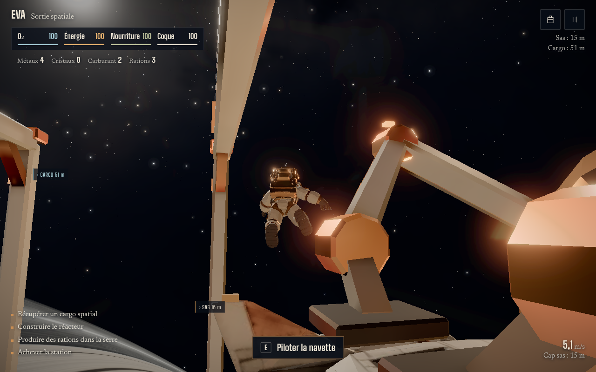

# Kepler-9 EVA

Un jeu de survie à la troisième personne dans le navigateur, construit sur la station Kepler-9. On part d'un petit habitat, on sort en combinaison, on pilote une navette pour ramasser des cargos, puis on reconstruit la station : réacteur, serre, anneau habité, observatoire.




**Jouer** : https://kepler-9-eva.vercel.app

## Commandes

- Ordinateur : ZQSD ou WASD, souris pour la caméra, E pour interagir, Espace et C pour monter ou descendre, Maj pour accélérer, Tab pour les réserves et la construction, Échap pour la pause.
- Téléphone : joystick à gauche, glisser à droite pour regarder, boutons à l'écran.

Oxygène, énergie et nourriture baissent pendant les sorties. Le réacteur donne de l'énergie, la serre produit des rations, les impacts abîment la coque. La partie est sauvegardée dans le navigateur.

## Stack

three.js, Vite, JavaScript. Tests avec `node --test` pour la simulation et Playwright pour les parcours dans le navigateur.

## Lancer

```sh
npm ci
npm run dev       # port 4350
npm run build
npm run preview   # port 4351
```

## Tests

```sh
node --test tests/simulation.test.js    # ressources, construction, sauvegardes, secours
node --test tests/controller.test.js    # sas, gravité, collisions
python tests/browser.py                 # parcours complet dans Chromium (Playwright)
```

## Suite

Un portage Unity 6 du jeu est en cours, avec une démo WebGL : https://kepler-9-eva-unity.vercel.app
